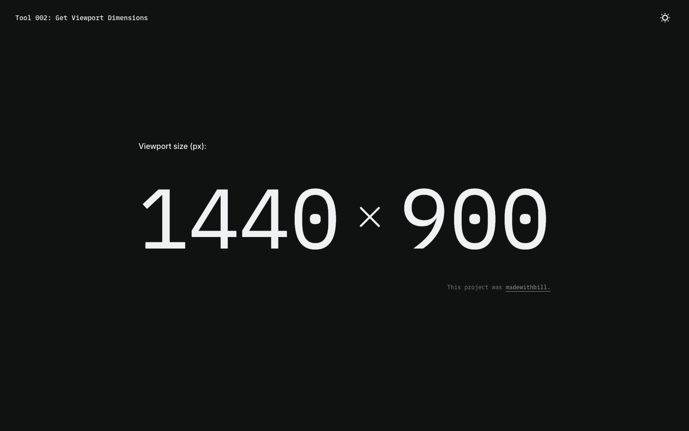

# Get Viewport Dimensions

A simple tool built in React to get a live readout of viewport dimensions in the browser.

## Preview

## Key Features

- Live readout of viewport width and height
- Light/Dark mode toggle

## Techniques and Technoloogies

- React: Components, State management, Passing props, Conditional rendering, Event listeners, Side effect handling
- Reactive DOM updates through state management and useEffect hooks.
- CSS custom properties for straightforward color mode management.
- Custom CSS media queries for responsiveness down to mobile, specific to the nature of this tool.
- Desktop and mobile layouts created in Figma to guide development.
